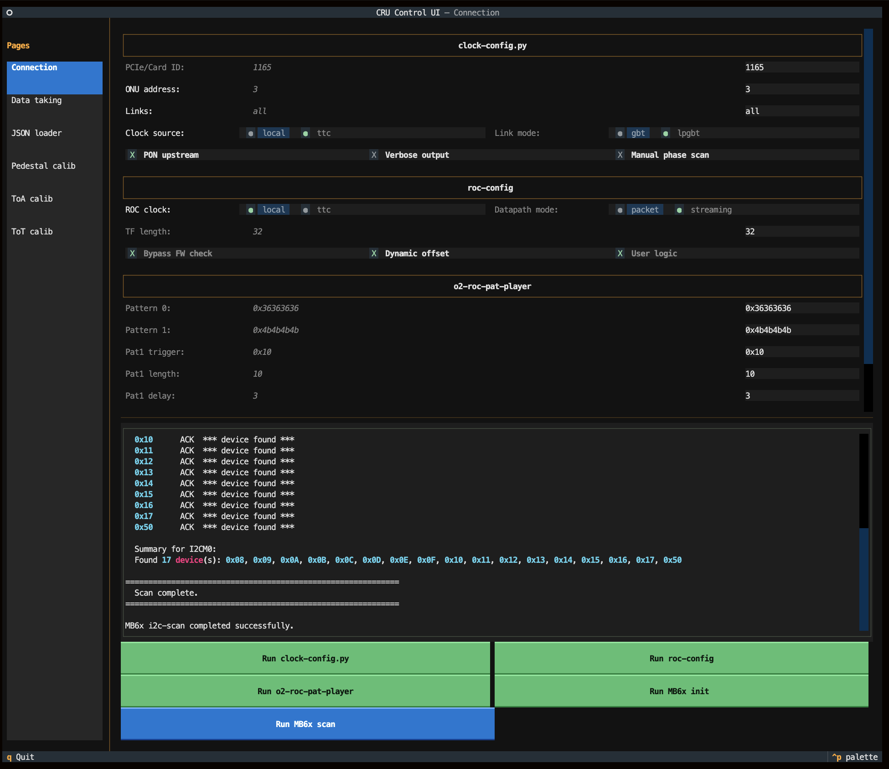

# CRU control

## Configuring the CRU through GUI

To start the GUI:&#x20;


```shellscript
cd /home/flp/cru-sw
source .venv/bin/activate 
python3 COMMON/sj_001_ui.py
```


<figure><figcaption></figcaption></figure>

## Changing the trigger delays & restarting the trigger&#x20;

Setting the trigger delay:&#x20;


```shellscript
o2-roc-pat-player --id=1165 --pat0=0x36363636 --pat1=0x4b4b4b4b --pat1-trigger-select=0x10 --pat1-delay=<delay_setting> --pat1-length=16 --pat3=0x36363636 --pat3-length=1
```


Setting the system id (which is 39):&#x20;


```shellscript
o2-roc-ul --id 1165 --system-id <system_id> --event-size 8000
```


Turning on the trigger:&#x20;


```shellscript
cd /home/flp/LTU cat FASTLM | atb 57
```


Turning off the trigger:&#x20;


```shellscript
cd /home/flp/LTU cat EOT | atb 57
```

