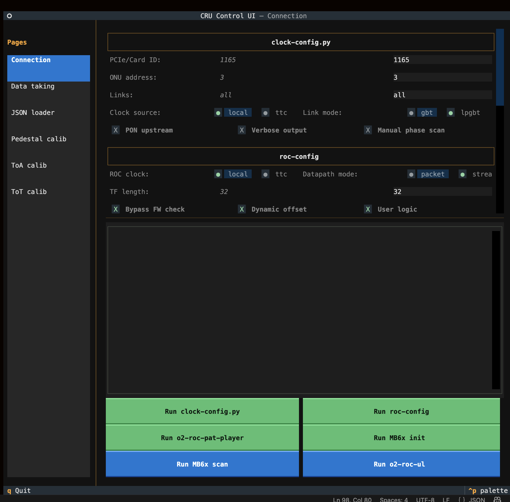
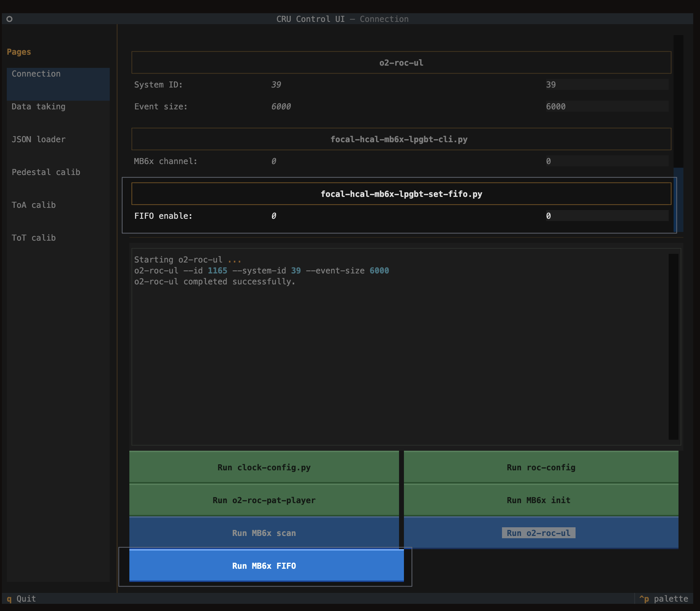
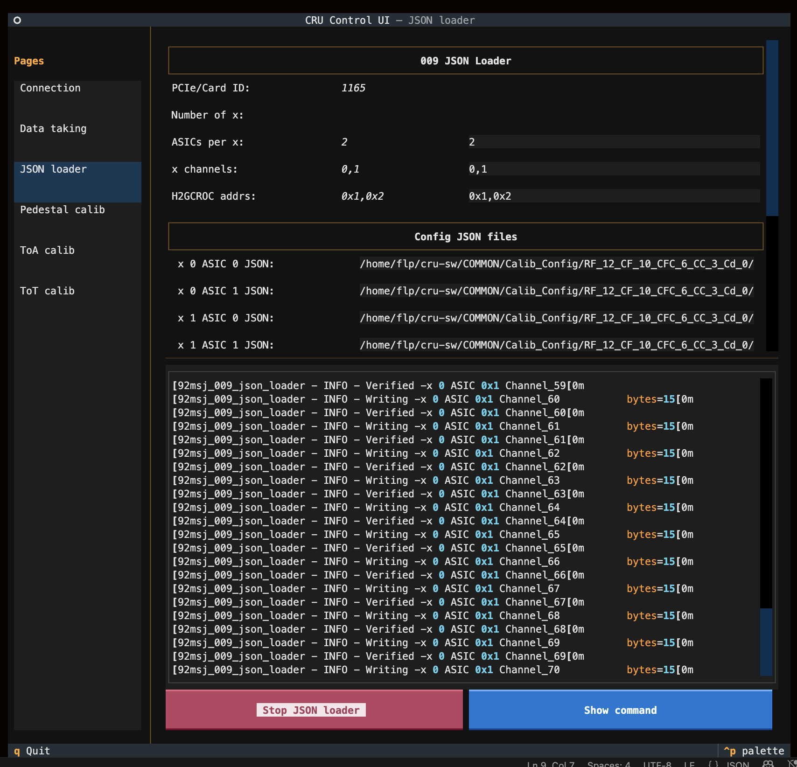
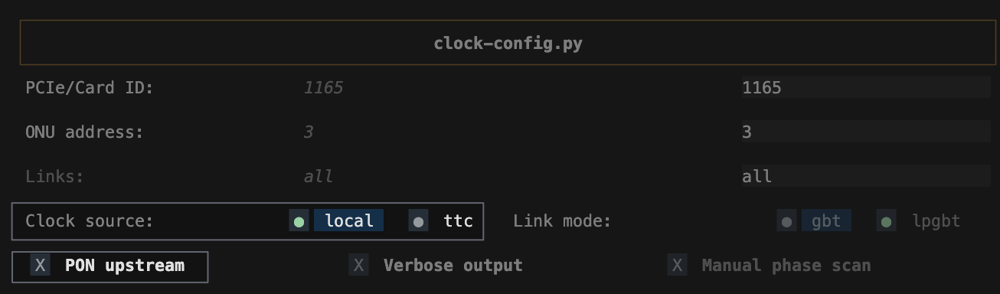
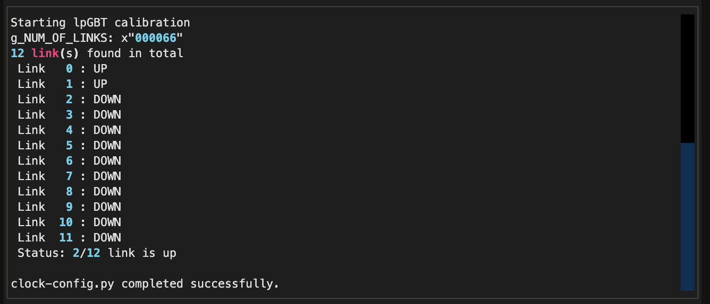
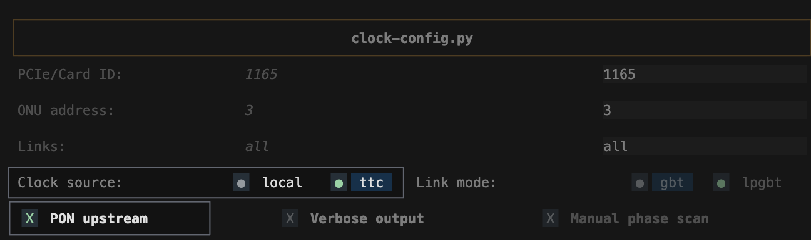

# RoC (Readout Chip) Configuration

The signal from SiPMs is weak and fast, so it needs to be amplified and digitized. This is done by the RoC (Readout Chip) which is H2GCROC in our case.
Configuring the RoC is done via a Terminal UI in the FLP. As always, you need to log in to the FLP first:


```shellscript
ssh flp@alio2-flp-focal
```


<div style="border-left: 4px solid #0969da; background: #ddf4ff; padding: 0.8rem 1rem; margin: 1rem 0;">
<strong>Note:</strong> If you cannot ssh into the FLP, you can try to ping it using the command <code>ping alio2-flp-focal</code>. If you cannot ping it, call Shihai/Tommaso.
</div>

## Program the CRU

(run as root)


```shellscript
cd ~/focaltb_fw/2026-07-04-dl-fifo-en
for i in 1; do /root/intelFPGA_pro/24.1/qprogrammer/quartus/bin/quartus_pgm --cable=$i --mode=JTAG --operation="p;cru_paddedx12.sof"; done;
source ~/rescan_only.sh
```


<div style="border-left: 4px solid #ef4b4e; background: #fff0f0; padding: 0.8rem 1rem; margin: 1rem 0;">
<strong>Critical:</strong> The following steps are out of date and never run them without clear instructions from experts.
</div>

To load the old firmware, you need to run the following steps:

```shellscript
cd ~/focaltb_fw/2025-10
for i in 1; do /root/intelFPGA_pro/24.1/qprogrammer/quartus/bin/quartus_pgm --cable=$i --mode=JTAG --operation="p;cru_paddedx12.sof"; done;
source ~/rescan_only.sh
```


## Load the configuration files

To load the configuration files, you need to run the following steps:

1. Open the Terminal UI
2. Set the FIFO option to `1`
3. Initialize the lpGBT
4. Load the configuration files
5. Reset the FIFO option to `0`
6. Set the roc-config
7. Set the pattern player
8. Initialize the lpGBT (same as step 3)
9. Set the User Logic

<div style="border-left: 4px solid #ef4b4e; background: #fff0f0; padding: 0.8rem 1rem; margin: 1rem 0;">
<strong>Critical:</strong> The following steps are out of date and never run them without clear instructions from experts.
</div>

The sequence of steps for loading the configuration files for the "old firmware" is as follows:

1. Open the Terminal UI
2. Set the local clock source
3. Initialize the lpGBT
4. Load the configuration files
5. Unset the local clock source / Set the LTU clock source
6. Set the roc-config
7. Set the pattern player
8. Initialize the lpGBT (same as step 2)
9. Set the User Logic

### Open the Terminal UI

First, we need to open the Terminal UI:


```shellscript
cd /home/flp/cru-sw
source .venv/bin/activate
python3 COMMON/sj_001_ui.py
```


Then you should see it pop up like this:



### Set/Reset the FIFO option



To set the FIFO option, go to the `Connection` tab on the left, and in the `focal-hcal-mb6x-lpgbt-set-fifo.py` section, set the `FIFO enable` to `1` and click `Run MB6x FIFO` button.

To reset the FIFO option, set the `FIFO enable` to `0` and click `Run MB6x FIFO` button again.


### Initialize the lpGBT

There are two lpGBT chips used, so to initialize them, go to the `focal-hcal-mb6x-lpgbt-cli.py` section of the `Connection` down at the bottom, set the `MB6x channel` to `0` and click `Run MB6x init` button, if successful, **set the `MB6x channel` to `1` and click the button again**.

### Load the configuration files

Go to the `JSON loader` tab on the left, and in the `Config JSON files` section, set the files as follows:

**RF_4_CF_4_CFC_4_CC_3_Cd_0**
x 0 ASIC 0: /home/flp/cru-sw/COMMON/Calib_Config/RF_4_CF_4_CFC_4_CC_3_Cd_0/SN_D13_D25_D5_D12/asicD13_final_calib_i2c_L1_40.json
x 0 ASIC 1: /home/flp/cru-sw/COMMON/Calib_Config/RF_4_CF_4_CFC_4_CC_3_Cd_0/SN_D13_D25_D5_D12/asicD25_final_calib_i2c_L1_40.json
x 1 ASIC 0: /home/flp/cru-sw/COMMON/Calib_Config/RF_4_CF_4_CFC_4_CC_3_Cd_0/SN_D13_D25_D5_D12/asicD5_final_calib_i2c_L1_40.json
x 1 ASIC 1: /home/flp/cru-sw/COMMON/Calib_Config/RF_4_CF_4_CFC_4_CC_3_Cd_0/SN_D13_D25_D5_D12/asicD12_final_calib_i2c_L1_40.json

**RF_12_CF_10_CFC_6_CC_3_Cd_0**
x 0 ASIC 0: /home/flp/cru-sw/COMMON/Calib_Config/RF_12_CF_10_CFC_6_CC_3_Cd_0/SN_D13_D25_D5_D12/asicD13_final_calib_i2c_L1_40.json
x 0 ASIC 1: /home/flp/cru-sw/COMMON/Calib_Config/RF_12_CF_10_CFC_6_CC_3_Cd_0/SN_D13_D25_D5_D12/asicD25_final_calib_i2c_L1_40.json
x 1 ASIC 0: /home/flp/cru-sw/COMMON/Calib_Config/RF_12_CF_10_CFC_6_CC_3_Cd_0/SN_D13_D25_D5_D12/asicD5_final_calib_i2c_L1_40.json
x 1 ASIC 1: /home/flp/cru-sw/COMMON/Calib_Config/RF_12_CF_10_CFC_6_CC_3_Cd_0/SN_D13_D25_D5_D12/asicD12_final_calib_i2c_L1_40_dummy.json

**RF_9_CF_8_CFC_6_CC_3_Cd_0**
x 0 ASIC 0: /home/flp/cru-sw/COMMON/Calib_Config/RF_9_CF_8_CFC_6_CC_3_Cd_0/SN_D13_D25_D5_D12/asicD13_final_calib_i2c_L1_40.json
x 0 ASIC 1: /home/flp/cru-sw/COMMON/Calib_Config/RF_9_CF_8_CFC_6_CC_3_Cd_0/SN_D13_D25_D5_D12/asicD25_final_calib_i2c_L1_40.json
x 1 ASIC 0: /home/flp/cru-sw/COMMON/Calib_Config/RF_9_CF_8_CFC_6_CC_3_Cd_0/SN_D13_D25_D5_D12/asicD5_final_calib_i2c_L1_40.json
x 1 ASIC 1: /home/flp/cru-sw/COMMON/Calib_Config/RF_9_CF_8_CFC_6_CC_3_Cd_0/SN_D13_D25_D5_D12/asicD12_final_calib_i2c_L1_40_dummy.json

Then, click the `Load JSON configs` button, and you should see the following output flowing in the log window:



If you see lots of RD_WAIT errors, make sure which firmware is loaded and check with experts if you need to do the `Set the local clock source` step above.

### Set the roc-config

Click the `Run roc-config` button in the `Connection` tab.

### Set the pattern player

Click the `Run o2-roc-pat-player` button in the `Connection` tab.

### Set the User Logic

Click the `Run o2-roc-ul` button in the `Connection` tab.

### Set the local clock source

<div style="border-left: 4px solid #9a6700; background: #fff8c5; padding: 0.8rem 1rem; margin: 1rem 0;">
<strong>Warning:</strong> We only need to do this if it is made clear that we are using the old firmware.
</div>

To change the clock source, go to the `Connection` tab on the left, and in the `clock-config.py` section:



Set the `Clock source` to `local` and **uncheck** the `PON upstream` option. Then click `Run clock-config.py` button. You should see the following output if successful:



If the number of up links are not 2, or it fails, **retry 3 times**. If it still fails, call Shihai.

### Unset the local clock source / Set the LTU clock source

<div style="border-left: 4px solid #9a6700; background: #fff8c5; padding: 0.8rem 1rem; margin: 1rem 0;">
<strong>Warning:</strong> Only do this if it is made clear that we are using the old firmware, and you have already set the local clock source.
</div>

It is the same section but the reverse. 



Set the `Clock source` to `ltu` and **check** the `PON upstream` option. Then click `Run clock-config.py` button. You should see the same output as above if successful.
