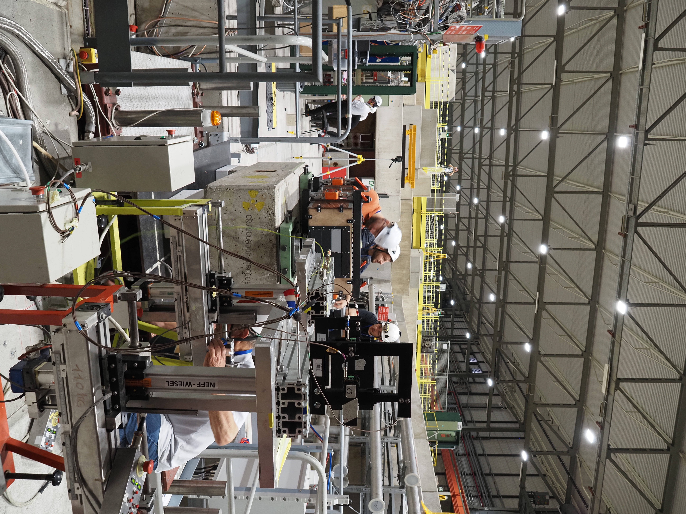
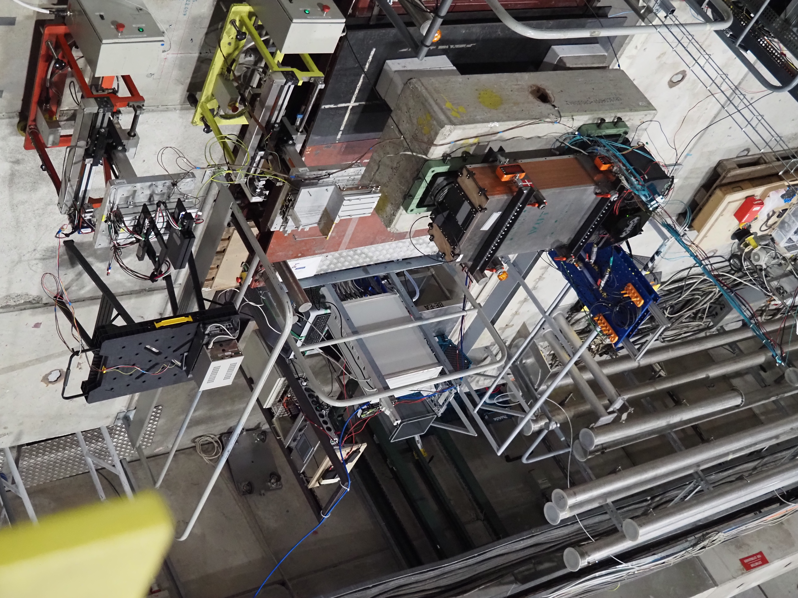
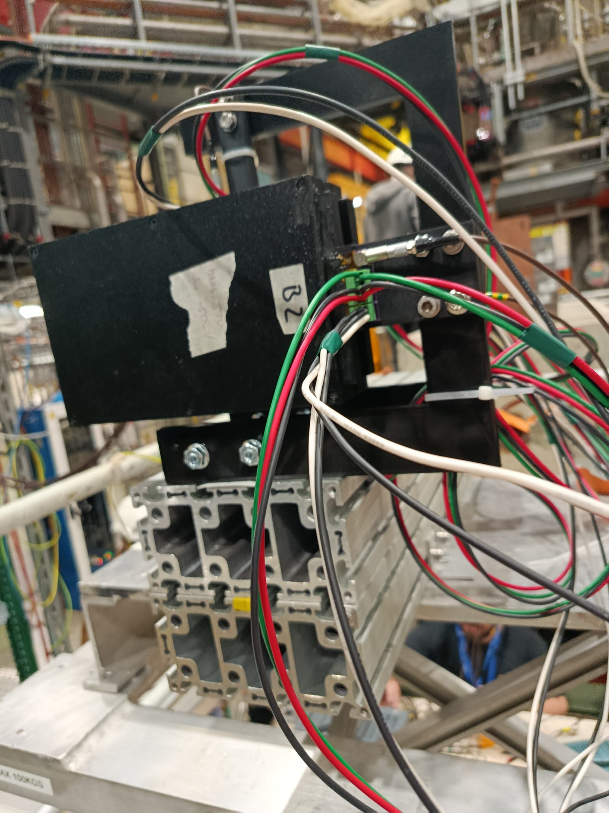
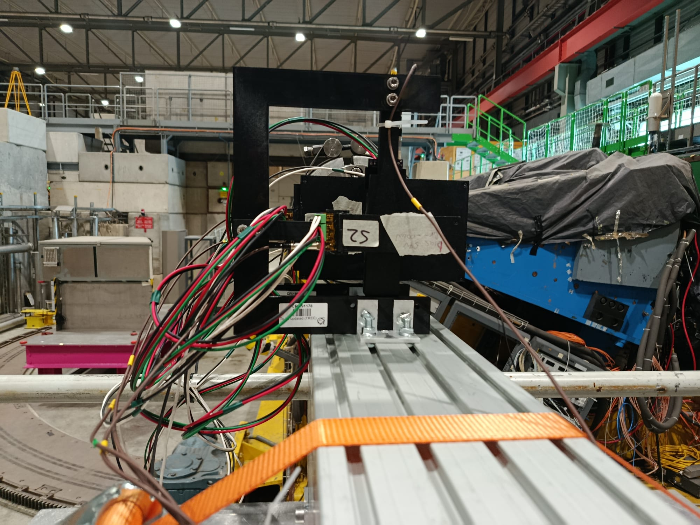
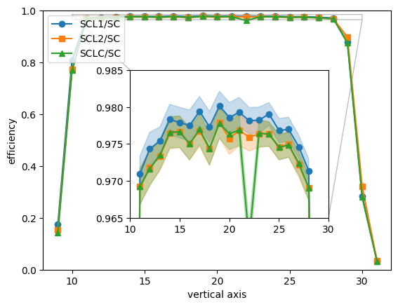
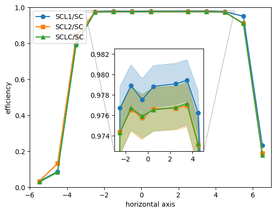

# Trigger setup & control

<figure><figcaption></figcaption></figure> <figure><figcaption></figcaption></figure>

The triggers are SiPM based and directly coupled to 1cm x 10cm or 10cm x 20cm plastic scintillator plates wrapped in ESR foil and encased in a 3D printed casing. The SiPMs are S13360-3025PE, with a Vbr of approximately 52V.



<figure><figcaption></figcaption></figure> <figure><figcaption></figcaption></figure>

All of the triggers should work reasonably well with a -100mV threshold, except  one which should be operated at about 50mV (as indicated on the tape).&#x20;

The 3 cables attached to the detector should be cables as follows:&#x20;

* 2 pins for HV (black ground, and other one is +HV)
* The 3 pin cable is +5V (red), gnd (black) and -5V (blue cable with green plug)
* The lemo cable can go directly into a nim discriminator

The +5V does not need to be exact, while the -5V should really be -5V or slightly more.&#x20;

A first efficiency analysis has been performed for the triggers based on the 2026 April LFHCal test beam.&#x20;

<figure><figcaption></figcaption></figure> <figure><figcaption></figcaption></figure>

You can control the trigger SiPM bias with the following Keithley link: [http://128.141.151.107/](http://128.141.151.107/). Same user name and password as for the other one.&#x20;

