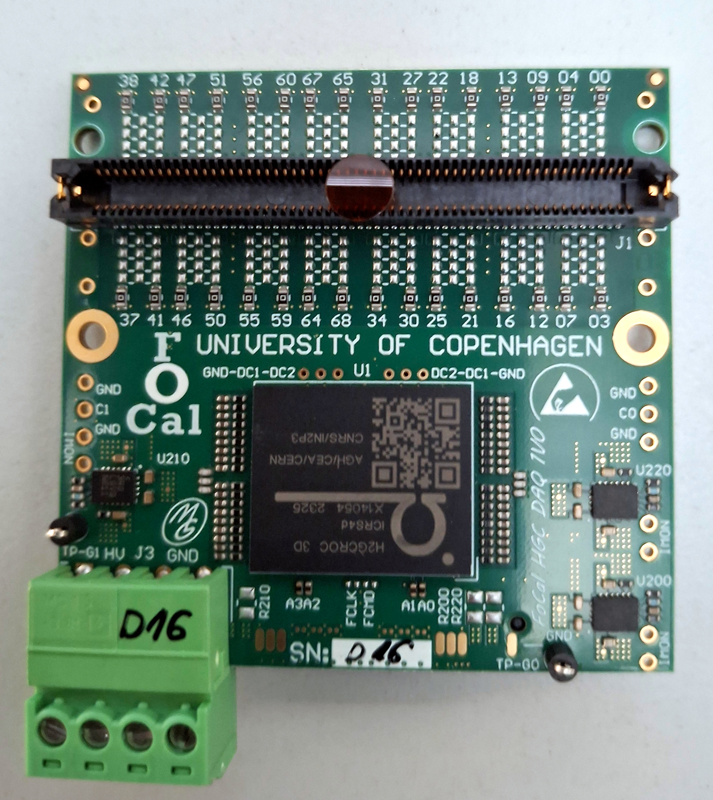

# Electronics

## Components

<figure><figcaption></figcaption></figure> <figure><figcaption></figcaption></figure>

<figure><figcaption></figcaption></figure>

<figure><figcaption></figcaption></figure>

<figure><figcaption></figcaption></figure>

<figure><figcaption></figcaption></figure>

<figure><figcaption></figcaption></figure>

<figure><figcaption></figcaption></figure>

## Monitoring the Bias Voltage for SiPM-Boards

For monitoring and changing the bias voltage of the SiPM boards please connect to the Keithley [http://128.141.151.105/](http://128.141.151.105/).&#x20;

Connect to the virtual frontend panel (button on the left) using the credentials on the table.&#x20;

<figure><figcaption></figcaption></figure>

