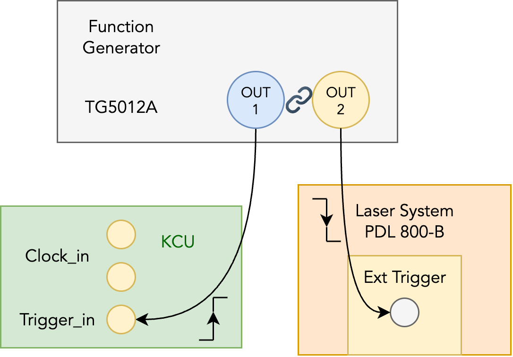
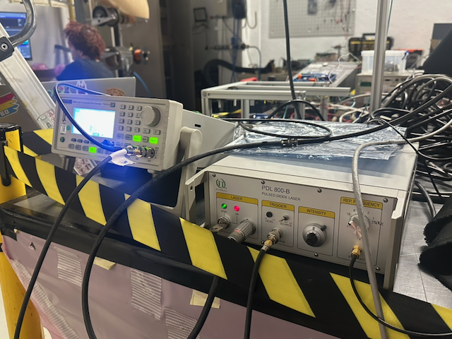

# Laser injection test setup

## Trigger scheme

The triggers for the laser system (PDL 800-B) and for the data acquisition system (KCU board) are both from the same function generator (TG5012A).

<figure><figcaption></figcaption></figure>

<strong>Note:</strong> The two outputs from TG5012A is not automatically synchronized, so you need to press the `align` button after changing the frequency settings.

Because of PDG 800-B is triggered on the falling edge and KCU is triggered on the rising edge, you need to adjust the delay settings of the KCU trigger by the width of the laser pulse in order to ensure they roughly coincide.
    
<figure><figcaption>The function generator (left) and the laser system (right) used in September 2026.</figcaption></figure>

The sampling clock on the front-end ASIC (H2GCROC) is derived from the 40MHz clock provided by the KCU board, such that the actual sampling is asynchronized with the laser signal, creating a time jitter between the laser pulse and the ASIC sampling.
Further, the falling time of the signal from the function generator is limited to ~ 5ns, bringing an additional timing uncertainty in the same order to the actual laser timing.

In the laser test in September 2026, an L1Offset value of 8 (the default value) and an ex trg delay of 16 (set in H2GDAQ) is used, effectively delaying the sampling time by 8 clock cycles (8 * 25 ns = 200 ns).

