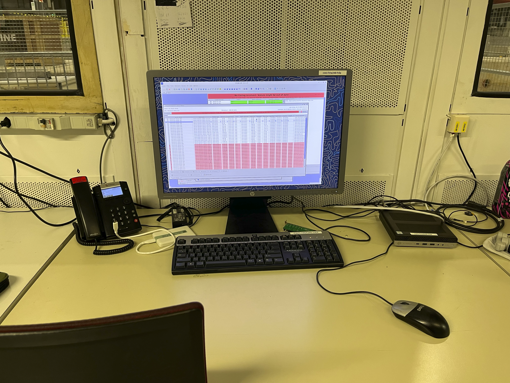
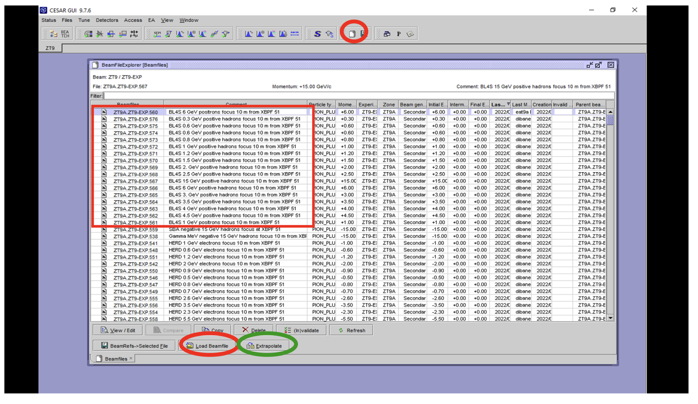
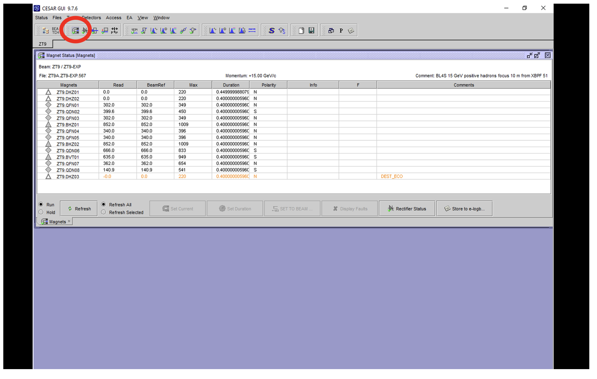
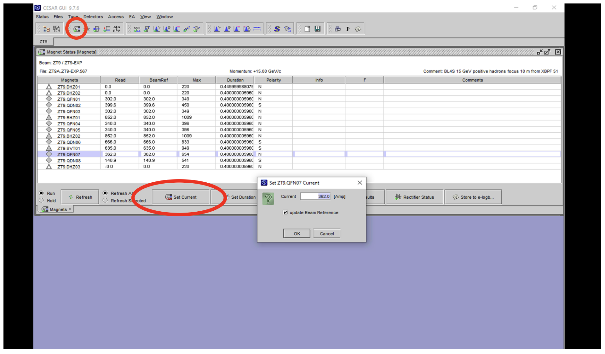
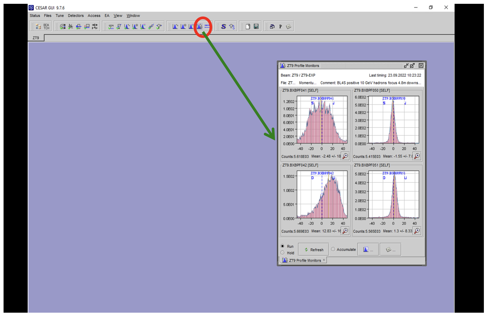
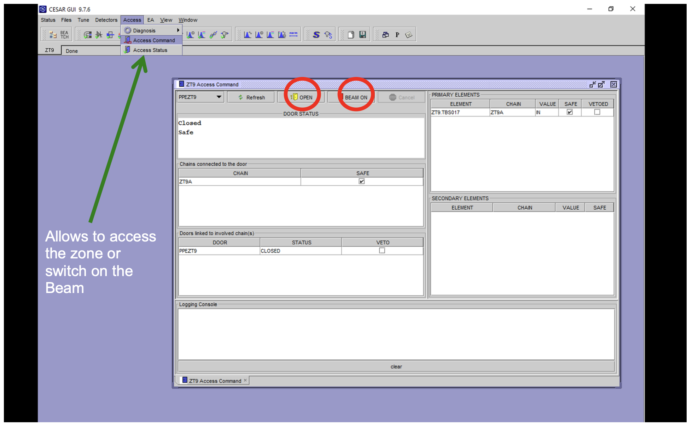

# Controlling the Beam

The beam is controlled on the computer to the right of the shifter station, the one next to the stationary phone:

This is where you can change between different beam types and energies by loading beamfiles, check the beam quality through the beam profiles and open/close the door into the test beam area if an access is needed. All of this is done using the CESAR GUI.

## Loading beamfiles:

To load a beamfile, first press on the icon looking like a piece of paper in the upper right to visualise all the available beamfiles, then press on the one you want and finally on "Load Beamfile". 

Please note that the red ones are NOT available (so do not try to load them!) and that for the electrons, the noted energy is negative because the electrons are negatively charged.

If the load beam file button is not available, you have to press the stop button in the upper right corner to stop the loaded beamfile from before before you can load the new one. 

Once you have loaded the beam file, another screen pops up where you can visualise the status of the magnets and so on: wait for everything to turn green, and then you will be able to take data with the new configuration.

Some of the magnets can be quite slow to turn green: don't worry, this is normal. 

### THIS SHOULD RARELY HAPPEN!
However, if these are the 3 magnets: BEND.022.117, BEND.022.053 or BEND.022.083, you should manually change their current settings as they might not be configured correctly automatically.

Also note that XCIO.022.450 will not turn green, and will stay yellow as it is OUT of the configuration. 

#### Setting magnet current to beam ref (for BEND.022.117, BEND.022.053 and BEND.022.083)
If these 3 bending magnets are not turning green a couple of minutes after loading the beam file, you should manually change their settings. To do so, press on the magnet status icon in the upper left corner:

Then press on the magnet name, then Set to Beamref. 

##### DEPRECATED: manually setting the magnet current
If this is not possible, you can manually set the current to the beamref value like this:

## Checking beam profiles:

Once you have loaded a beamfile, it is always good to check the quality of the beam through the beam profile, which is available here:

This button shows all the available beam profiles, but in reality, the most important one is the Delay Wire Chamber Profile (available in the button with the blue Gaussian and just the clock: if you're in doubt, you can swipe the mouse without clicking on the icons to see a short description of each icon).

Check the Run and Accumulate boxes in the bottom of the interface and wait for a little bit to get decent statistics. The beam profiles are supposed to look quite Gaussian, but might be a bit negatively skewed (= shifted to the right), like you can see on the bottom left beam profile in the picture above. Consult the beam-specific beam profile in the table below to see example images of what each specific beam profile is supposed to look like.

## Opening and closing the door:

During your shift, someone might need to access the beam area: if this happens, you must be able to turn off the beam, make the area safe and open the door through the CESAR GUI.

To do so, go Access -> Access Command -> Beam On, and log in with your CERN account credentials. The GUI will tell you to wait for a couple of minutes, and at a certain point in the upper left of the interface, it will say that the beam is no longer on and that the area is safe.

It is not possible to access the area unless you press on the yellow door icon and on Open.

To close and turn the beam back on, you must first Close the door through the yellow door icon and then once the area is Safe again, you can turn the beam back on and load a new beamfile. These steps once again require you to log in using your CERN credentials.

## **Electrons**

<table><thead><tr><th>beam profile name</th><th width="183">energy (G</th><th>approximate purity</th><th>approximate number of part/spill</th></tr></thead><tbody><tr><td>H4A.ALICE FOCAL.000</td><td>20</td><td></td><td></td></tr><tr><td>H4A.ALICE FOCAL.001</td><td>40</td><td></td><td></td></tr><tr><td>H4A.ALICE FOCAL.002</td><td>60</td><td></td><td></td></tr><tr><td>H4A.ALICE FOCAL.003</td><td>80</td><td></td><td></td></tr><tr><td>H4A.ALICE FOCAL.004</td><td>100</td><td></td><td></td></tr><tr><td>H4A.ALICE FOCAL.005</td><td>150</td><td></td><td></td></tr><tr><td>H4A.ALICE FOCAL.006</td><td>200</td><td></td><td></td></tr><tr><td>H4A.ALICE FOCAL.022</td><td>250</td><td>~70%</td><td>~6.1K</td></tr><tr><td>H4A.ALICE FOCAL.023</td><td>300</td><td>~50%</td><td>~1K</td></tr></tbody></table>

## Hadrons (+)

<table><thead><tr><th>beam profile name</th><th width="183">energy (GeV)</th><th width="183">approximate purity</th><th>approximate number of part/spill</th><th data-type="image"></th><th></th></tr></thead><tbody><tr><td>H4A.ALICE FOCAL.036</td><td>60</td><td></td><td>~1.6K</td><td></td><td></td></tr><tr><td>H4A.ALICE FOCAL.035</td><td>80</td><td></td><td>~8.4K</td><td></td><td></td></tr><tr><td>H4A.ALICE FOCAL.034</td><td>100</td><td></td><td>~17K</td><td><a href="../.gitbook/assets/H4.Profile.Monitors.2026.07.04.01.03.56.png">H4.Profile.Monitors.2026.07.04.01.03.56.png</a></td><td><a href="https://be-op-logbook.web.cern.ch/elogbook-server/GET/showEventInLogbook/4598792">https://be-op-logbook.web.cern.ch/elogbook-server/GET/showEventInLogbook/4598792</a></td></tr><tr><td>H4A.ALICE FOCAL.033</td><td>150</td><td></td><td>~44K</td><td></td><td></td></tr><tr><td>H4A.ALICE FOCAL.024</td><td>200</td><td></td><td>~14-16K</td><td></td><td></td></tr><tr><td>H4A.ALICE FOCAL.030</td><td>250</td><td></td><td>~8.5K</td><td></td><td></td></tr><tr><td>H4A.ALICE FOCAL.037</td><td>300</td><td></td><td>~3.7K???</td><td></td><td></td></tr><tr><td>H4A.ALICE FOCAL.038</td><td>350</td><td></td><td>~65K???</td><td></td><td></td></tr></tbody></table>
