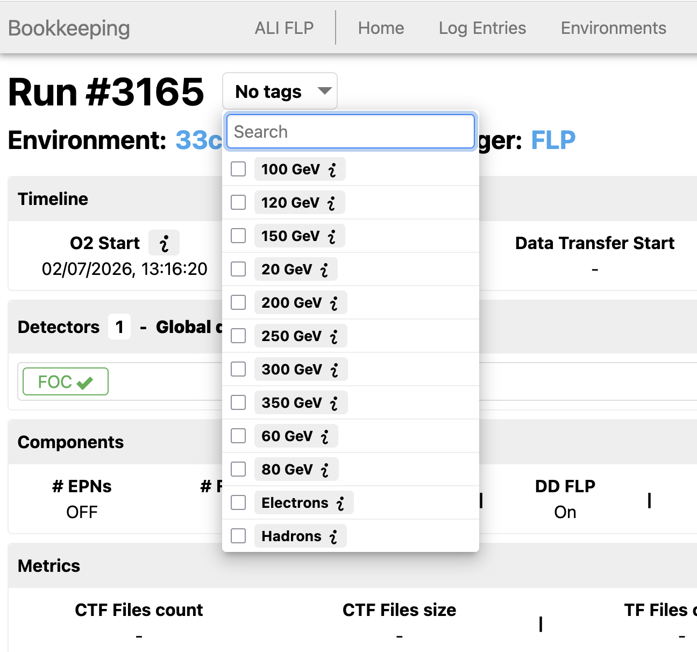
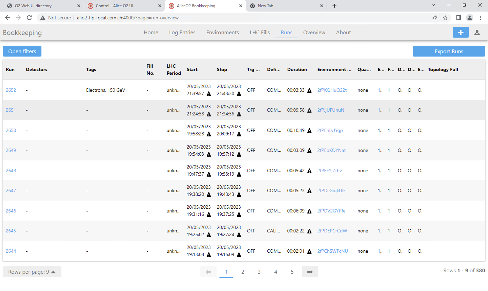
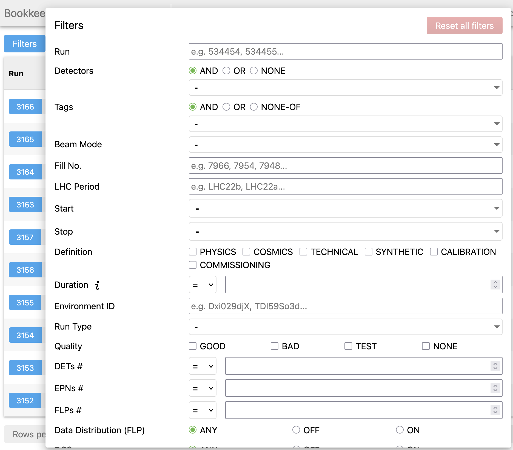
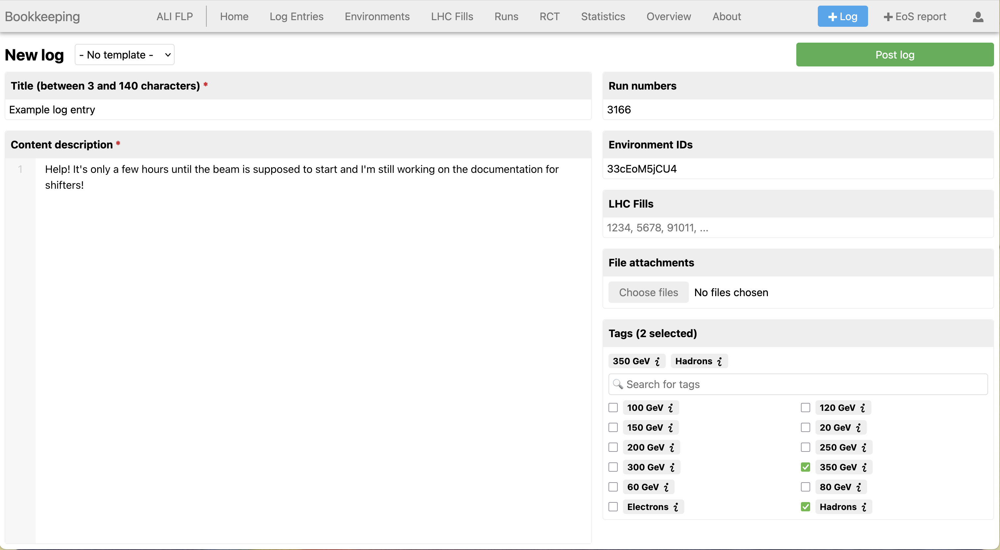

# Bookkeeping

To keep track of each run that we perform during the testbeam, it is important to be consistent about recording problems and solutions as they come up. To this end, you should will need to keep track of things using two separate bookkeeping entries: 
- The ALICE bookkeeping system that can be accessed [here](http://alio2-flp-focal.cern.ch:4000/)
- The Google sheet that can be accessed [here]

## ALICE Bookkeeping System

The bookkeeping system helps us to keep track of the settings of each run. It also becomes a record of problems that come up (and, importantly, how to solve them). To see the list of runs, click on the **Run** header. To see a specific run, click on the corresponding run number in the list.

### Tagging runs
2 tags are needed for each run - beam type and energy.

- Once inside the run, click on **Edit Run**
- A field with the tags will then pop up, and you can tick the tag to select it:

- Once the runs are tagged, you'll find the beam configuration under "tags" in the logbook

In the future, this will help a lot to filter runs, because this can be used in the bookkeeping filter tool:

### Making Logs
When problems come up during a run, note them down using the bookkeeping **Log** functionality. 

- Next to **Edit Run**, you will see another button, **Add log to this run**
- Give your log a relevant name and tags, and then describe the error that came up, including any relevant error messages from infologger, etc

- Finally, click the **Post log** button to publish it
- Once your log is posted, other people can reply to it, for example with solutions to the described problem

It is important to make a log of any issues that are solved during a run unless otherwise informed!

## Bookkeeping Sheet

## Logbook Template

### General information
**Run number:**

**Number of events:**

**Synchronized:**

### Beam configuration
**Particle:**

**Energy (GeV):**

### Table position
**Horisontal position:**

**Vertical position:**

### FoCal-H settings
**Trigger scheme:**

**Threshold:**

**Gain:**

**Bias:**

**ECAL in front**

**Run number / configuration file:**

**Saved:**

### Other comments
xx

