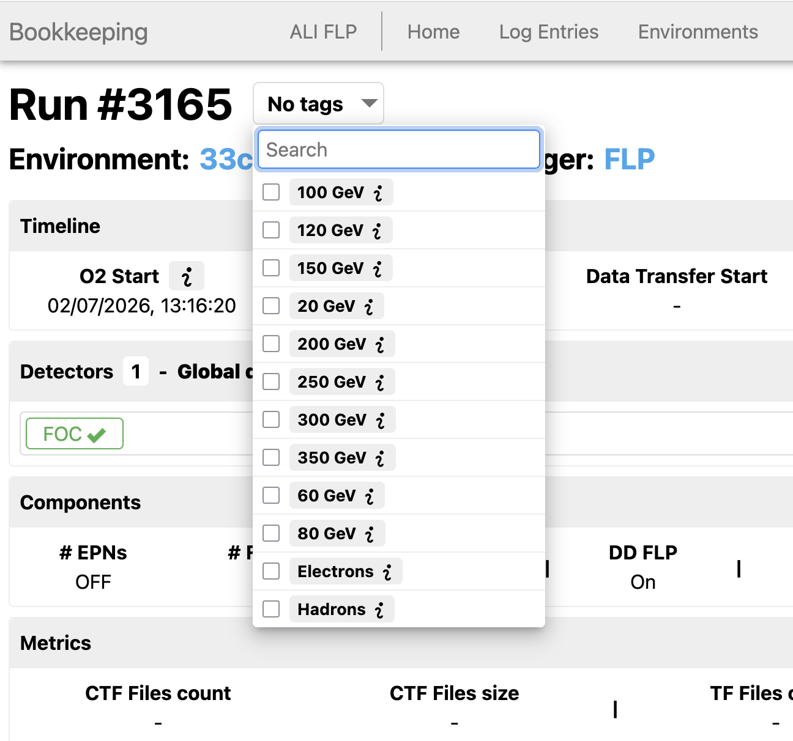
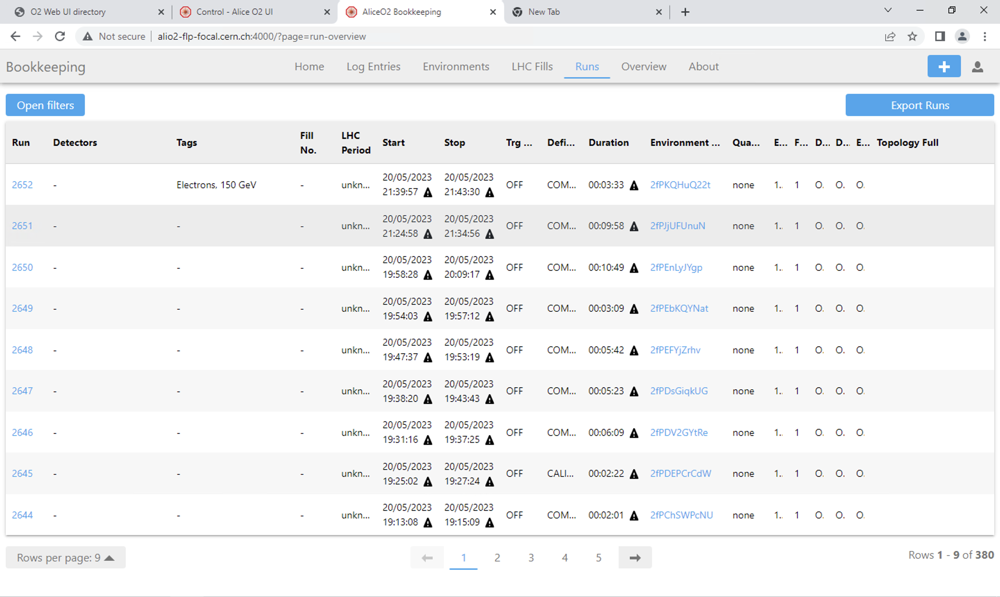
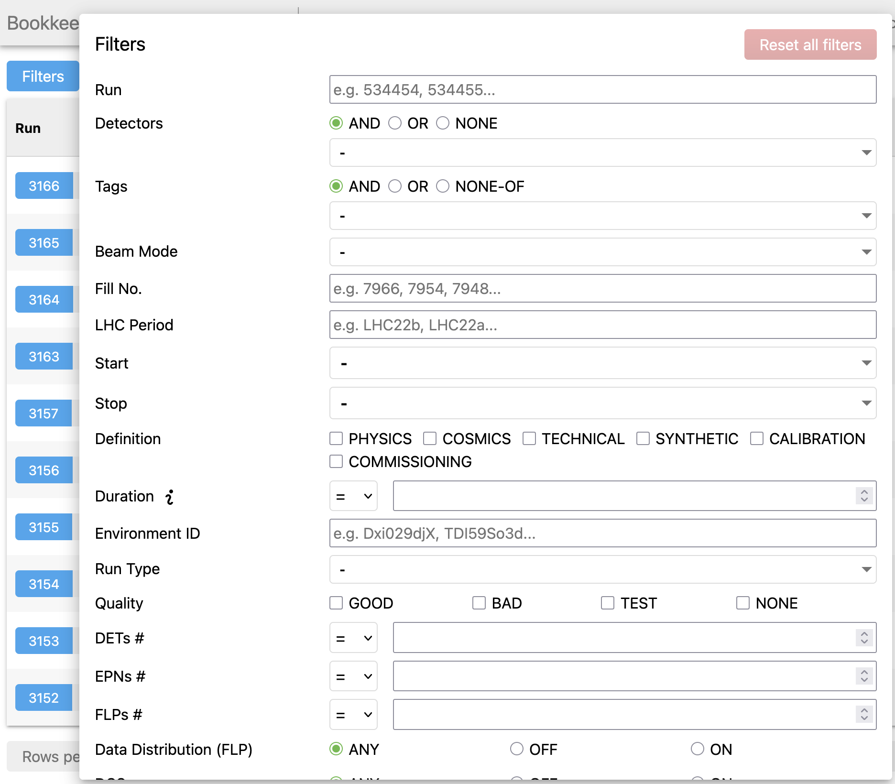
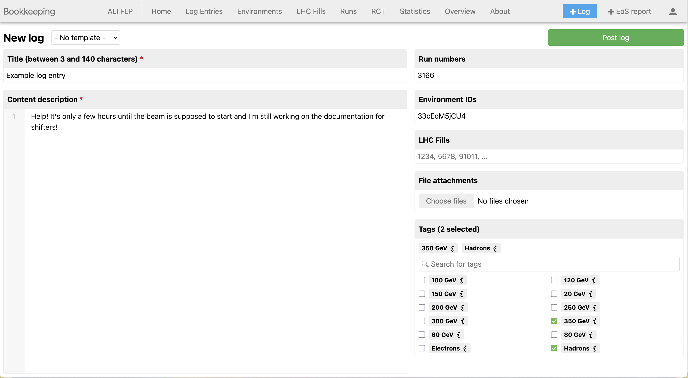

# Bookkeeping

To keep track of each run that we perform during the testbeam, it is important to be consistent about recording problems and solutions as they come up. To this end, you will need to keep track of things using two separate bookkeeping entries: 
- The ALICE bookkeeping system that can be accessed [here](http://alio2-flp-focal.cern.ch:4000/)
- The Google sheet that can be accessed [here](https://docs.google.com/spreadsheets/d/1CEVsBG8wgO2F9DYG3_Rz1IMYbPuPbzVct7_hPUwUYgk/edit?usp=sharing)

## ALICE Bookkeeping System

The bookkeeping system helps us to keep track of the settings of each run. It also becomes a record of problems that come up (and, importantly, how to solve them). To see the list of runs, click on the **Run** header. To see a specific run, click on the corresponding run number in the list.

### Tagging runs
2 tags are needed for each run - beam type and energy.

- Once inside the run, click on **Edit Run**
- A field with the tags will then pop up, and you can tick the tag to select it:

- Once the runs are tagged, you'll find the beam configuration under "tags" in the logbook

In the future, this will help a lot to filter runs, because this can be used in the bookkeeping filter tool:

### Making Logs
When problems come up during a run, note them down using the bookkeeping **Log** functionality. 

- Next to **Edit Run**, you will see another button, **Add log to this run**
- Give your log a relevant name and tags, and then describe the error that came up, including any relevant error messages from infologger, etc

- Finally, click the **Post log** button to publish it
- Once your log is posted, other people can reply to it, for example, with solutions to the described problem

It is important to make a log of any issues that are solved during a run unless otherwise informed!

## Bookkeeping Sheet

We also have a Google sheet for more manual tracking of information about each run's configuration settings. This will be more easily accessible outside of the CERN network (though the other system can still be viewed using [EduVPN](https://eduvpn.docs.cern.ch/)). 
The Google Sheet can be accessed [here](https://docs.google.com/spreadsheets/d/1CEVsBG8wgO2F9DYG3_Rz1IMYbPuPbzVct7_hPUwUYgk/edit?gid=0#gid=0).
PLEASE DO NOT TRY AND CHANGE THE GOOGLE SHEETS LAYOUT.

## Logbook Template

### General information
**Date:**

**Time:**

**Run number:**

**Environment ID:**

**Run purpose:**

**Number of events:**

**Root file naming:**

### Beam configuration
**Particle:**

**Energy (GeV):**

### Table position
**Horisontal position:**

**Vertical position:**

### FoCal-H settings
**Trigger scheme:**

**Threshold:**

**Temperature:**

**Gain:**

**Bias:**

**ECAL in front**

**Run type:**

**Run number / configuration file:**

**Saved:**

### Other
**QC:**

**Notes:**

xx

## IMPORTANT NOTES
- Don't forget to log in both locations!
- For maximum ease of information accessibility, please don't forget to attach detailed run information to the main ALICE system (don't just log it in the sheet!) - use the template above and post it as a run log

# End of Shift (EOS) Reports
During your shift, you should be compiling a document highlighting the most important parts of your shift and giving relevant information to the next shifters after you. 
To do so, you can log into [CodyMD](https://codimd.web.cern.ch) with your CERN credentials and write in markdown using the layout below.
At the end of your shift, please submit the report by pressing the +EOS report next to +log in the upper right corner in the [ALICE bookkeeping system](http://alio2-flp-focal.cern.ch:4000/), then press ECS then compile it and finally submit.

# End of shift report - FOCAL - DD/MM/YYYY Morning/Afternoon/Night

### Shifters: 
- Name Surname
- Name Surname

### Issues during the shift:
- 

## SPS:
- `xx:xx`:

## SHIFT FLOW:
- `xx:xx`:

## NOTES: 

## INFO FOR NEXT SHIFTER:

You can use this as an example:

# End of shift report - FOCAL - 03/07/2026 Morning

### Shifters: 
- Leonora Misciattelli Mocenigo Soranzo,
- Monalisa Melo,
- Misiki Bharadwaz

### Issues during the shift:
- Local home disc filled up, so we had to manually move some files. Both raw and root files are now automatically stored to the correct location.

## SPS:
- `07:00`: STABLE BEAM, approx. 3 spills. Only electrons 100 GeV available.
- `13:30`: New beam files available

## SHIFT FLOW:

- `07:00`: FOCAL Shift: Start.
    Waiting for support from expert Nina Nathanson.
    
- `10:00`-`12:30`: Only test runs, Tommaso and Nina debugging.

- `12:30`-`13:30`: Access to TB area

- `13:30`-`15:00`: Taking data

- `15.00`: FOCAL Shift: End.

## NOTES: 
No longer using the manual Environment creation, but rather the Global Runs -> FOCAL PHYSICS -> Deploy. Consult the Shifter Overview for more information.

## INFO FOR NEXT SHIFTER:
No longer using the manual Environment creation, but rather the Global Runs -> FOCAL PHYSICS -> Deploy. Consult the Shifter Overview for more information. 

