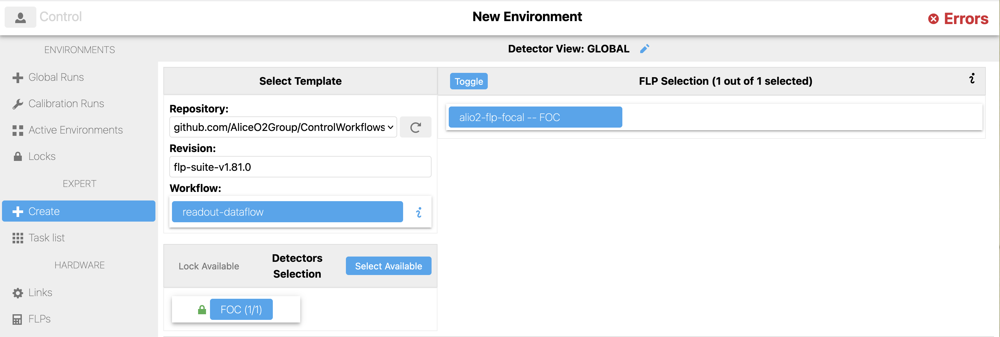
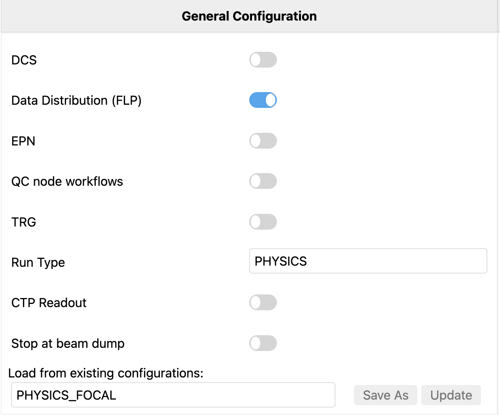
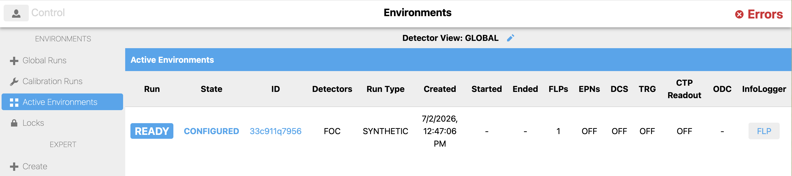
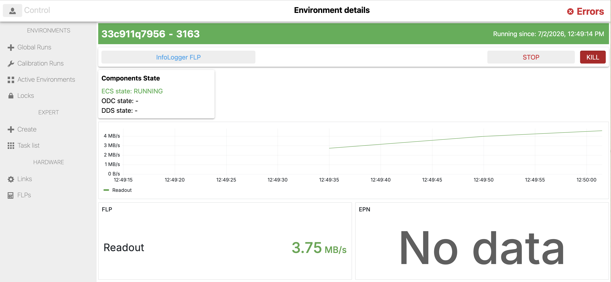

# ECS Overview

Data taking for the test beam is now controlled through the central Control system, which can be found [here](http://alio2-flp-focal.cern.ch:8080/). When you enter the ECS for the first time, click on **Global** view.

## Setting up an Environment

Before beginning a data taking run, you must first create an environment, a self-contained configuration of the components to be used in the run. To create the environment, click on **Create**, which is listed in the left sidebar under **EXPERT**. Click on readout-dataflow, and then select the FOC detector. If you cannot select the detector, make sure you have also taken the lock, which should be green!

Under "General Configuration", load the configuration **PHYSICS_FOCAL** and make sure the run type is set to **PHYSICS**.

Finally, at the bottom of the page, create the environment using the button labelled **Deploy**. The environment will then appear under **Active Environments** and begin configuration. It will receive its own unique ID that can be used to search for issues coming from the environment in the Infologger if needed (see next section about **controlling runs**).

## Controlling Runs

Once the environment is configured, it will show that it is **CONFIGURED** and **READY** for a run. 

From within the environment, click the button to **START** the run and confirm that it begins without issue.

You can then continue to monitor the run through the Infologger and QC (see dedicated section about **QC**) until it is time to **STOP** the run through the ECS GUI again. After the run has stopped, **SHUTDOWN** the corresponding environment.

## Output of runs

### Raw data output

### Root file output

The ECS is currently set up to reconstruct events live as the run is happening. These root files are stored on the FLP, and can be found at `/home/flp/reco_output/`. The naming convention currently is currently `focalevents_{environment_id}.root`.

## IMPORTANT NOTES

- Each environment can only be used for a single run, but they will not shut down automatically when the run is stopped -  instead, you will need to manually shutdown the environment every time, so do it as soon as the run is stopped to prevent confusion about environments.
- Please do not **KILL** the environment! Always wait for **SHUTDOWN**.
- Previously, there has been an issue where environments that have been shutdown do not disappear from the Control GUI. If this starts up again, don't worry about it - let us know and we will clear them, but it is low priority, just be careful to keep track of which environment you are using.
- It is expected that once the run has started, the EPN will show **No Data**, as we do not have an EPN. 
- DO NOT TOUCH ANYTHING UNDER THE HEADING **HARDWARE**