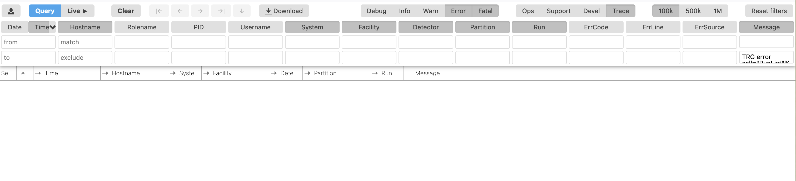

# Error Tracking

Error monitoring during runs is done by checking the Infologger, which can be found [here](http://alio2-flp-focal.cern.ch:8081/?q={%22message%22:{%22exclude%22:%22TRG%20error%20call=%5C%22RunList%5C%22%25%0A%0ASubTimeFrame%20deserialization%20failed.%25%22},%22severity%22:{%22in%22:%22E%20F%22}}). 

## Infologger

### Modes

The infologger can run in two modes: **Query** and **Live**. As the names imply, the **Live** mode allows you to monitor ongoing runs and catch error messages as they come up, while **Query** allows you to search through the error log. 

When you first enter the infologger, its message display setting will automatically be set to **Query**, so you must manually change it over to **Live**. 

### Filters
There are a variety of options for what messages the infologger can be configured to display. 
- This is mostly useful if you would like to perform a query, and look for errors that came up during a specific run or time period 
- The filters are displayed as headers (see Hostname, Rolename, PID, etc in the image below) and can be controlled by typing in the two rows of text field below each header

- The first header (on the far left of the GUI) is **Date/Time**. As indicated by the GUI text, you can set the time interval you want to search in by adding the start time to the top row, and the end time to the bottom.
- For the rest of the filters, the top row works as an include filter, while the bottom works as an exclude filter
- So, for example, to look at error messages coming from a specific run, enter the run number in the first text field under the header **Run** 
- Press the **Query** button again to apply the filters and update the display

**NB**: These filters are not removed automatically! If you decide to switch back to **Live** mode after making a filtered query, make sure to remove whatever filters you have added. If you can't remember what you added and what was already there, reload the page with the default filter configuration we have set from the [link](http://alio2-flp-focal.cern.ch:8081/?q={%22message%22:{%22exclude%22:%22TRG%20error%20call=%5C%22RunList%5C%22%25%0A%0ASubTimeFrame%20deserialization%20failed.%25%22},%22severity%22:{%22in%22:%22E%20F%22}}). 

### Default Filter Settings
Some error messages are known by us going in to the test, i.e. not important for you as the shifter to worry about. We have set up some default filter settings for the shifter layout, so that you do not have to worry about them! The link above automatically applies those filters when you load the page. If you are suddenly getting a bunch of errors, your first port of call should be to double check that you haven't accidentally removed these filters, just in case.

## IMPORTANT NOTES
- Always check your infologger mode! If an environment or run is in error and you are not seeing any error messages, make sure it is not because you are accidentally stuck in **Query**.
- It is advised that you clear all error messaages and return to **Live** mode before you deploy a new environment, so that you do not get confused by error messages coming from previous environments/runs.
