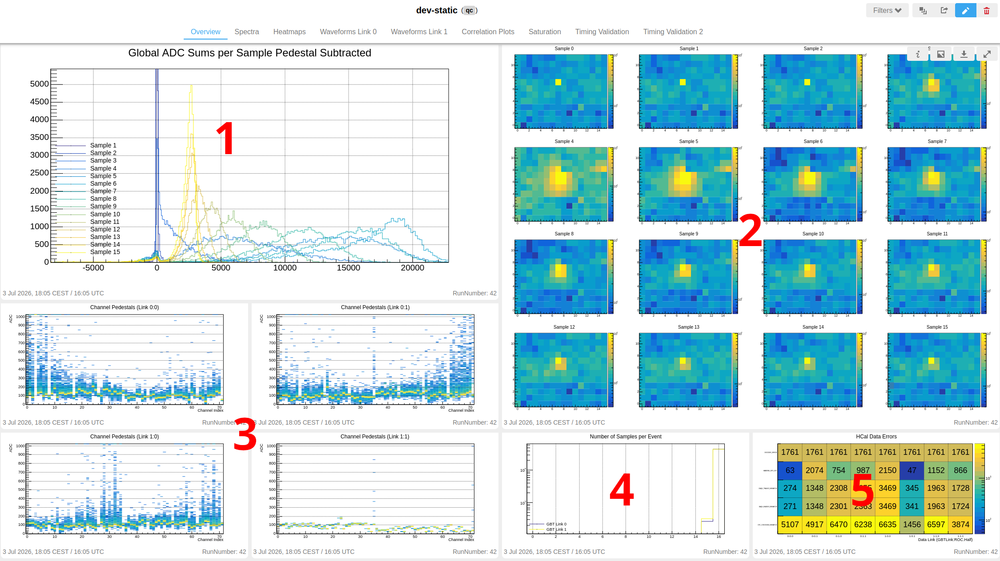
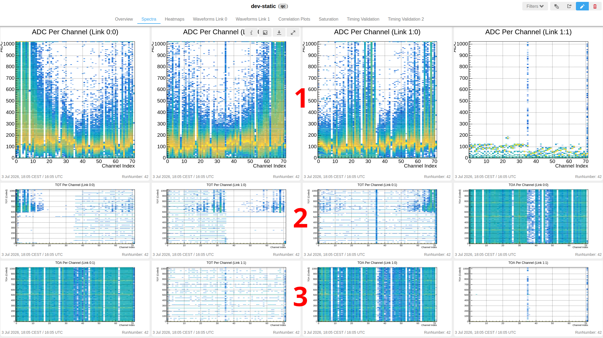
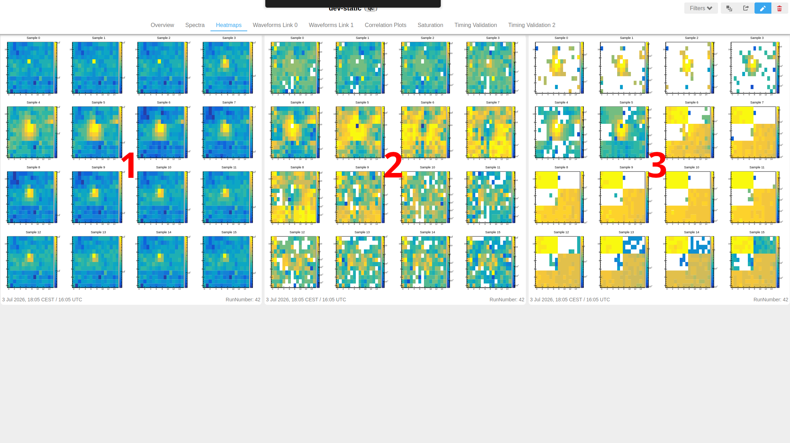
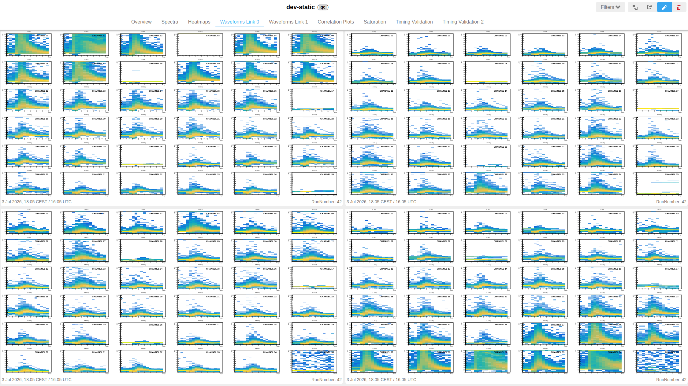
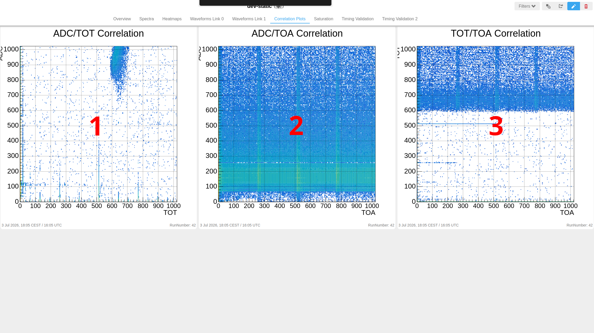
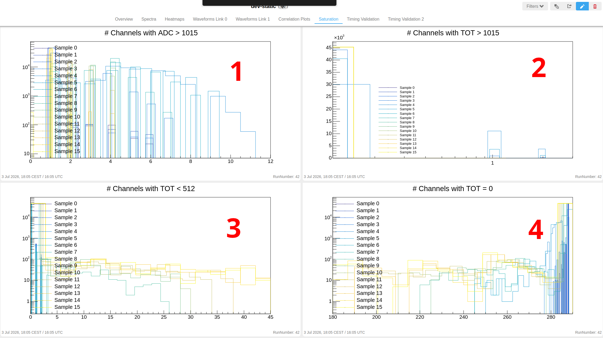
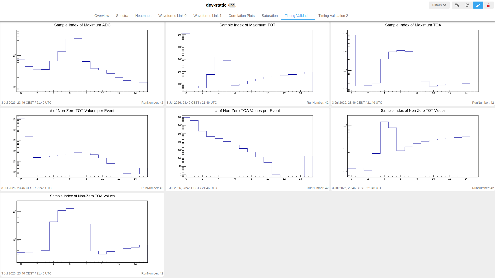
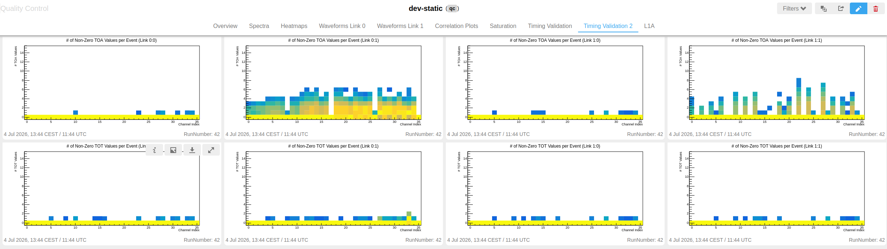
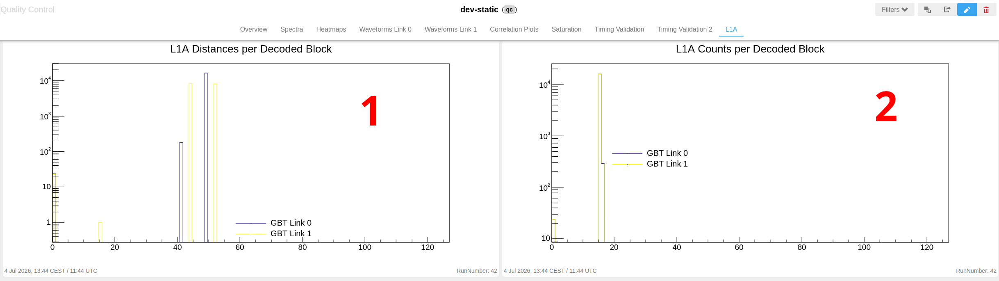

# QC Overview

Data monitoring during runs can now be performed by monitoring the QC layout, which can be found [here](http://alio2-flp-focal.cern.ch:8082/). In each of the sections below, you will find an overview of each set of plots (corresponding to the tabs in the QC layout) - what they show, how to interpret them and what they are supposed to look like if is going to plan. 

## Layouts

In the QC GUI on the left-hand side, you will find a panel with some different layouts. Relevant for this test-beam are two layouts: `dev-auto` and `dev-static`.
They are identical in content - the only difference is that `dev-auto` will automatically switch between the tabs in a fixed interval, which will ensure that the plots are updated. For whatever reason, our QCG version does not have monitoring enabled, so the plots will *not* automatically update. Because of this, it is recommended that you by default use the `dev-auto` layout. If you are on the `dev-static` page, you must either select a tab or click "Update" for the plots to refresh.

### Overview

The Overview page contains a number of different plots that are meant to give a quick idea of the status of the detector and the quality of the current run. If there are any significant problems with the current run, it will usually be evident by at least one of the plots.

This page can be divided into five sections:

<b>Global ADC Sums (1)</b> shows the per-event ADC sum of all channels in the detector, with the pedestal subtracted, for each sample in the event. Sample 0 is assumed to be equivalent to the pedstal, and as such sample 0 is omitted from this plot since it will simply be all zeroes. 

<b>ADC Heatmaps (2)</b>  shows the event-average ADC in each channel of the detector, as the channels are actually positioned when viewed from behind, i.e. towards the beam pipe. Each of the plots show one sample, with the first sample in the top-left and the last sample in the lower-right corner. Each sample plot scales the maximum automatically, so that the beam spot always is visible.

<b>Pedestals (3)</b> shows the values of the pedestals (i.e. sample 0) for each HGCROC chip (72 channels per chip) that is connnected. On the horizontal axes are the channel indices on that ROC, with the vertical axes being the value of the pedestal in that channel. Generally, these should have very flat distributions throughout the entire run, but since the pedestal is calculated from the first sample, some fluctuations can be expected.

<b>Samples per Event (4)</b> shows how many samples were recorded for each event, on each GBT link. This value is determined in the configuration of the readout, and the QC is set up to expect the same amount of samples, in this picture 16. The number of samples should for any given event *always* be the expected number, so any event with fewer likely has some problem with it. As long as the number of events that deviate from the expected number of samples is fairly small, this is not a problem, and is in fact expected to some degree due to various number of errors that can arise in the data. 

<b>Data Errors (5)</b> shows how many times different types of data errors occured in the run so far, grouped by data link (horizontally) and error type (vertically). This is mostly a diagnostic plot and may not always be suitable to use to determine if something is wrong, since errors do occur relatively often. Many of these errors are not something we can do anything about, and often won't impact data in any serious manner. 

### Spectra

On this page you can find the values of ADC, TOT and TOA for every sample of every channel in the detector. 

<b>ADC Spectra (1)</b> is the first row of plots, which show the ADC (vertically) for each channel index (horizontally) in each HGCROC. Since these plots show *all* samples, it is expected that the distributions of ADC for any given channel is going to be fairly wide, if the corresponding channel is actually connected and gets signal.

<b>TOT Spectra (2)</b> is the second row of plots, where you can find the TOT values of each sample and channel. 

<b>TOA Spectra (3)</b> is the third row of plots, which contain the TOA values of each sample and channel.

### Heatmaps

The heatmaps page contains three canvases of plots. Each set of heatmaps are averaged over the number of events recorded.

<b>ADC (1)</b> to the left shows ADC heatmaps, which is the same plots are in the Overview page. There is literally no difference.
<b>TOT (1)</b> in the middle shows heatmaps for TOT values.
<b>TOA (2)</b> to the right shows heatmaps for TOA values.

### Waveforms 

The two "Waveforms" tabs shows each individual channels' ADC values from each sample, plotted as *waveforms*, hence the name of the tab. Horizontally is laid out the sample index, and vertically the ADC value in that sample. Each plot corresponds to one channel in the detector.

The channels are grouped by which data link they belong to; this is divided into quadrants. Each channel's plot also has the exact data link and channel number printed onto it, following the format <b>X:Y.Z/C</b>, where X is the GBT link ID; Y is the ROC ID on that link, Z is the data link (or "half") of that ROC, and C is the channel index on that half.

### Correlation Plots

This page contains three plots showing the correlations between ADC, TOT and TOA.

<b>ADC/TOT (1)</b> on the left is the correlation between ADC (vertical axis) and coded TOT value (horizontal axis).
<b>ADC/TOA (2)</b> in the middle shows the correlation between ADC (vertical axis) and coded TOA value (horizontal axis).
<b>TOT/TOA (3)</b> on the right has the correlation between coded TOT (vertical axis) and coded TOA value (horizontal axis).

### Saturation

On this page are a few histograms showing some statistics related to saturation of channels.

<b>ADC Saturated Channels (1)</b> shows how many channels are saturated in ADC, i.e. above a threshold value, per event. 
<b>TOT Saturated Channels (2)</b> shows how many channels are saturated also in TOT for each event. 
<b>TOT Under Half (3)</b> shows how many channels have a TOT value under 512 *but greater than zero*, again for each event.
<b>Zero TOT (4)</b> shows how many channels have a TOT value equal to exactly zero, i.e. TOT did not fire, for each event.

### Timing Validation 1

These plots are mostly for diagnostic purposes / expert usage. Description for these may or may not come at a later point.

### Timing Validation 2

As with the previous page, these plots are also just for diagnostic and expert usage.

### L1A 

This page contains a pair of plots related to L1A command diagnostics. Again, these are mostly for diagnostic / expert usage.

<b>L1A Distance (1)</b> shows the distribution of L1A distances per link.
<b>L1A Commands (2)</b> shows the number of L1A commands that was sent to each GBT link.

## Common Problems and Solutions

TBD.

## IMPORTANT NOTES

TBD.
